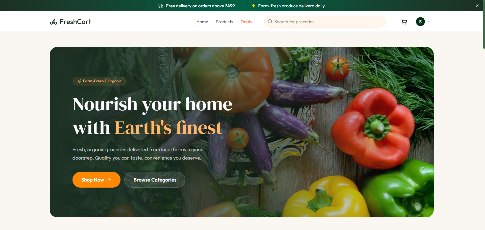
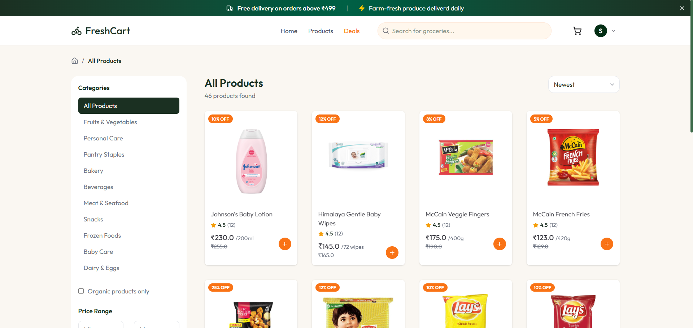
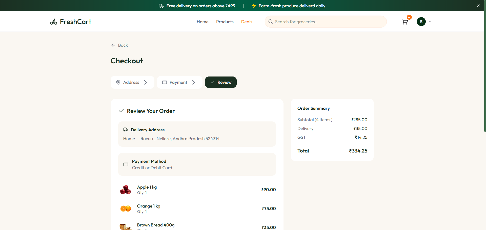
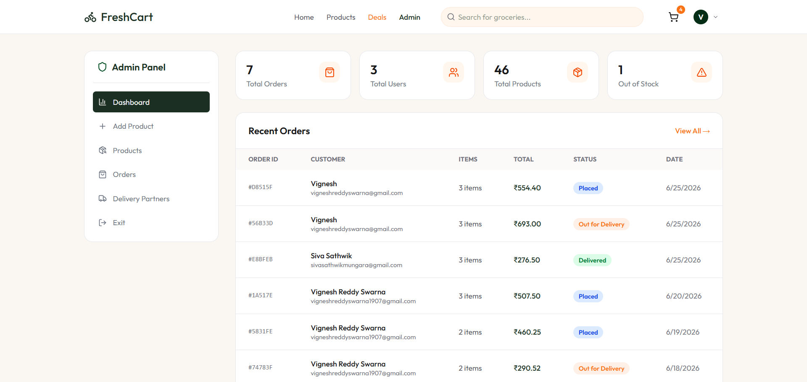
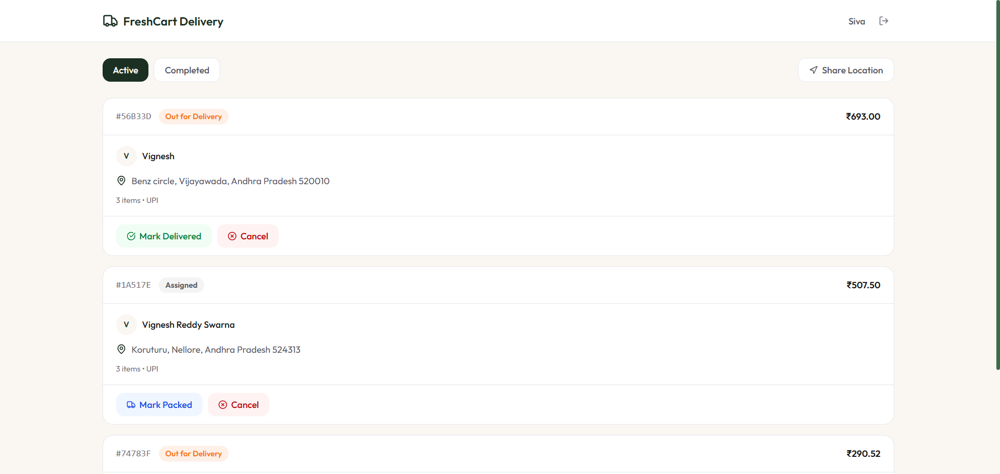
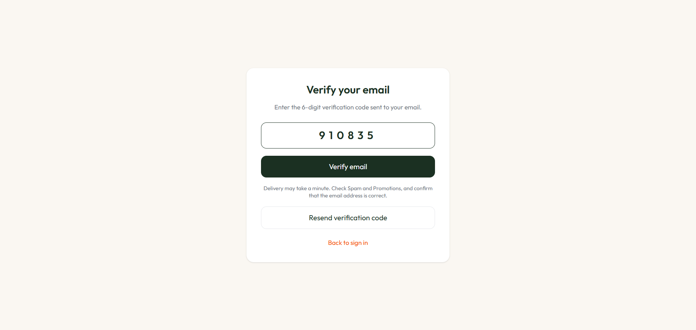

# FreshCart Grocery Delivery

FreshCart is a full-stack grocery delivery platform with customer shopping, admin operations, delivery partner workflows, Stripe payments, live order tracking, and email OTP verification.

[Live Website](https://grocery-delivery-web.vercel.app) | [API Health Check](https://grocery-delivery-api-omega.vercel.app)

Operational monitoring, readiness checks, backup drills, and incident response are documented in [OPERATIONS.md](OPERATIONS.md).

## Screenshots

### Storefront Home



### Product Catalog



### Checkout Review



### Admin Dashboard



### Delivery Partner Dashboard



### Email OTP Verification



## Highlights

- Customer storefront with product browsing, search, category filters, cart, checkout, saved addresses, and order history.
- Secure customer authentication with email OTP verification and password reset.
- Admin dashboard for product management, order management, delivery partner onboarding, and delivery assignment.
- Admin-confirmed delivery partner onboarding: admin enters partner details, OTP is sent to the partner email, and the partner account is created only after admin confirms the OTP.
- Delivery partner portal with assigned deliveries, status updates, live location sharing, and delivery OTP completion.
- Stripe checkout integration with webhook-based payment confirmation and stock handling.
- PostgreSQL data layer powered by Prisma migrations and generated Prisma client.
- Vercel-ready frontend and backend deployment configuration.

## Tech Stack

**Frontend**

- React 19
- TypeScript
- Vite
- Tailwind CSS
- React Router
- Axios
- Leaflet / React Leaflet

**Backend**

- Node.js
- Express 5
- TypeScript
- Prisma
- PostgreSQL / Neon
- Stripe
- Nodemailer / Brevo SMTP
- Cloudinary
- Inngest

## Project Structure

```text
.
|-- client/              # React frontend
|-- server/              # Express API, Prisma schema, migrations, services
|-- docs/screenshots/    # README screenshots
|-- package.json         # Root verification/build scripts
|-- vercel.json          # Frontend deployment config
|-- README.md
`-- LICENSE
```

## Core Workflows

### Customer

1. Sign up with name, email, and password.
2. Receive a 6-digit email OTP.
3. Verify email before signing in.
4. Browse products, manage cart, add address, and place orders.
5. Track order status and delivery OTP.

### Admin

1. Sign in with an admin email configured in `ADMIN_EMAILS`.
2. Manage products and orders.
3. Create delivery partners through OTP confirmation.
4. Assign active delivery partners to orders.

### Delivery Partner

1. Login after admin completes OTP-confirmed onboarding.
2. View assigned deliveries.
3. Update delivery status and share live location.
4. Complete delivery using the customer delivery OTP.

## Environment Variables

Create these files locally from the examples:

```text
client/.env
server/.env
```

### Client

```env
VITE_BASE_URL=http://localhost:5000/api
VITE_CURRENCY_SYMBOL=₹
```

For production:

```env
VITE_BASE_URL=https://your-backend-url.vercel.app/api
VITE_CURRENCY_SYMBOL=₹
```

### Server

```env
DATABASE_URL=
JWT_SECRET=
CLIENT_URL=http://localhost:5173
NODE_ENV=development

STRIPE_SECRET_KEY=
STRIPE_WEBHOOK_SECRET=

SMTP_USER=
SMTP_PASS=
SENDER_EMAIL=

ADMIN_EMAILS=admin@example.com

CLOUDINARY_CLOUD_NAME=
CLOUDINARY_API_KEY=
CLOUDINARY_API_SECRET=

INNGEST_EVENT_KEY=
INNGEST_SIGNING_KEY=
```

## Local Development

Install dependencies:

```bash
npm --prefix client install
npm --prefix server install
```

Generate Prisma client and apply migrations:

```bash
npm --prefix server exec prisma generate
npm --prefix server exec prisma migrate deploy
```

Run the backend:

```bash
npm --prefix server run dev
```

Run the frontend:

```bash
npm --prefix client run dev
```

## Quality Checks

Run the full verification command before deploying:

```bash
npm run verify
```

This runs:

- Client lint
- Client production build
- Client unit tests
- Server TypeScript typecheck
- Server build
- Server tests

GitHub Actions runs the same verification pipeline for every pull request and every push to `main`. Concurrent outdated runs are cancelled automatically.

Dependabot checks frontend, backend, and GitHub Actions dependencies. CodeQL performs JavaScript and TypeScript security analysis on pull requests, pushes to `main`, and a weekly schedule.
CI also blocks merges when production dependencies contain known high- or critical-severity vulnerabilities.

## Deployment

Deploy the backend and frontend as separate Vercel projects.

### Backend

- Root directory: `server`
- Install command: `npm ci`
- Build command: `npx prisma migrate deploy && npm run build`
- Required environment variables: all server variables listed above

### Frontend

- Root directory: `client`
- Install command: `npm ci`
- Build command: `npm run build`
- Output directory: `dist`
- Required environment variables:

```env
VITE_BASE_URL=https://your-backend-url.vercel.app/api
VITE_CURRENCY_SYMBOL=₹
```

## Security Notes

- `.env` files are ignored and should never be committed.
- Passwords are hashed with bcrypt.
- OTPs are stored as hashes, not plain text.
- Payment completion is handled through Stripe webhooks.
- Admin access is controlled through the `ADMIN_EMAILS` environment variable.
- API responses include restrictive security headers and requests are rate-limited per client.
- Authentication middleware requires an exact `Bearer <token>` authorization scheme and enforces account roles.

## License

This project is licensed under the MIT License.
