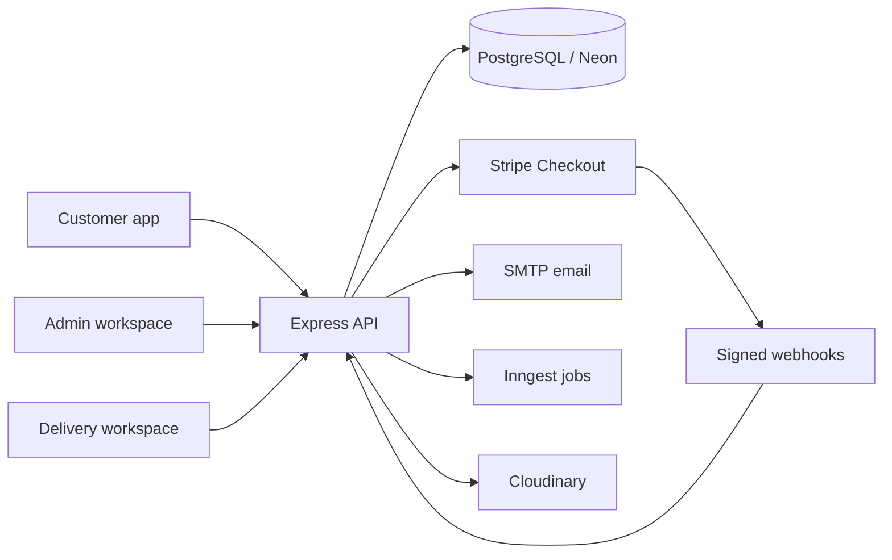

# FreshCart

A full-stack grocery delivery platform demonstrating the complete journey from product discovery to verified doorstep delivery. FreshCart includes dedicated customer, administrator, and delivery-partner experiences backed by secure authentication, Stripe test payments, inventory reservation, and live location tracking.

> Portfolio demo: online payments run in Stripe test mode. No real money is charged.

## Highlights

- Customer email signup, verification, login, password recovery, and Google Sign-In
- Product search, filtering, cart, saved addresses, checkout, and order history
- Card and UPI test payments with signed Stripe webhooks and idempotent fulfillment
- Atomic stock reservation with automatic release for failed or expired checkout sessions
- Admin dashboard for products, inventory, orders, and delivery-partner onboarding
- Delivery workspace with assigned orders, status updates, location sharing, and OTP completion
- Role-aware authorization and protected customer, admin, and delivery APIs
- Responsive React interface with route-level code splitting and optimized WebP assets
- Automated API/business-logic tests and GitHub Actions CI

## Architecture



## Technology

| Layer | Tools |
| --- | --- |
| Frontend | React 19, TypeScript, Vite, Tailwind CSS, React Router, Axios, Leaflet |
| Backend | Node.js, Express 5, TypeScript, Prisma ORM |
| Data | PostgreSQL on Neon |
| Integrations | Stripe, Google Identity, Brevo SMTP, Cloudinary, Inngest |
| Quality | ESLint, Vitest, Supertest, GitHub Actions |

## Run locally

Requirements: Node.js 22+, npm, and a PostgreSQL database.

```bash
git clone https://github.com/vigneshreddyswarna/Grocery-Delivery.git
cd Grocery-Delivery

cd server
cp .env.example .env
npm ci
npx prisma migrate deploy
npm run seed
npm run dev
```

In another terminal:

```bash
cd client
cp .env.example .env
npm ci
npm run dev
```

Open `http://localhost:5173`. Environment variables are documented in [client/.env.example](client/.env.example) and [server/.env.example](server/.env.example).

## Verification

```bash
# Frontend
cd client
npm run lint -- --max-warnings 0
npm run build

# Backend
cd server
npm run typecheck
npm test
```

Current automated suite: 11 tests covering registration, validation, lifecycle rules, idempotent payment fulfillment, and stock release. CI repeats lint, builds, type-checking, and tests for every push and pull request.

## Payment flow

1. The server validates products, quantities, address coordinates, and payment method.
2. Inventory is reserved atomically before checkout begins.
3. Stripe hosts card or UPI payment in test mode.
4. A signed webhook marks the order paid exactly once.
5. Failed or expired sessions delete the unpaid order and restore reserved stock.

Never add real credentials to the repository. `.env` files are ignored by Git.

## Project guides

- [Demo walkthrough](docs/DEMO.md)
- [API overview](docs/API.md)
- [Portfolio and interview notes](docs/PORTFOLIO.md)

## Status

This is a portfolio application, not a commercial grocery service. The repository intentionally uses test payments and seeded products while implementing production-style security and reliability patterns.

